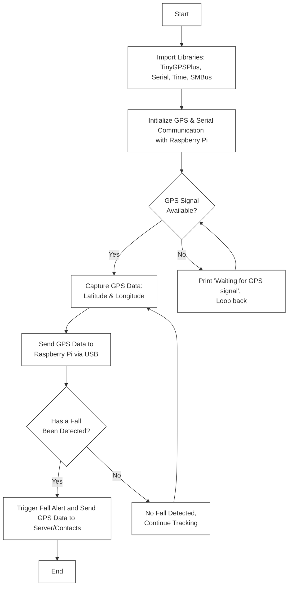

```mermaid
flowchart TD
    Start --> ImportLibraries[Import Libraries: TinyGPSPlus, \nSerial, Time, SMBus]
    ImportLibraries --> InitGPS[Initialize GPS & Serial Communication \nwith Raspberry Pi]
    InitGPS --> CheckSignal{GPS Signal \nAvailable?}
    CheckSignal -- Yes --> CaptureData[Capture GPS Data: \nLatitude & Longitude]
    CaptureData --> SendData[Send GPS Data to \nRaspberry Pi via USB]
    SendData --> FallCheck{Has a Fall \nBeen Detected?}
    FallCheck -- Yes --> TriggerAlert[Trigger Fall Alert and Send \nGPS Data to Server/Contacts]
    FallCheck -- No --> NoFall[No Fall Detected, \nContinue Tracking]
    CheckSignal -- No --> Waiting["Print 'Waiting for GPS signal'", \nLoop back]
    Waiting --> CheckSignal
    NoFall --> CaptureData
    TriggerAlert --> End
    End[End]

    %% Adding simplified styles to align with your reference flowchart
    style Start fill:#ffffff,stroke:#333,stroke-width:1px
    style ImportLibraries fill:#ffffff,stroke:#333,stroke-width:1px
    style InitGPS fill:#ffffff,stroke:#333,stroke-width:1px
    style CheckSignal fill:#ffffff,stroke:#333,stroke-width:1px
    style CaptureData fill:#ffffff,stroke:#333,stroke-width:1px
    style SendData fill:#ffffff,stroke:#333,stroke-width:1px
    style FallCheck fill:#ffffff,stroke:#333,stroke-width:1px
    style NoFall fill:#ffffff,stroke:#333,stroke-width:1px
    style TriggerAlert fill:#ffffff,stroke:#333,stroke-width:1px
    style Waiting fill:#ffffff,stroke:#333,stroke-width:1px
    style End fill:#ffffff,stroke:#333,stroke-width:1px
```